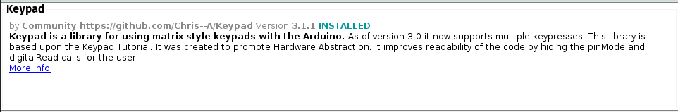

# Teclado Matricial
En esta carpeta se encuentra el archivo de proteus con la simulacion para el uso del teclado matricial, el codigo de arduino Y la captura de la libreria que deben utilizar.  
Mucho OJO con el fabricante o propietario de la libreria que tienen que instalar, para que no tengan problemas.  

El video de la explicacion se encuentra en el siguiente drive:  
[Video Explicacion Teclado Matricial](https://drive.google.com/file/d/18dSR8qukEZ2bldWvoRCy0sFSNzMP_BPq/view?usp=drive_link)  
  
Ademas les dejo un video de youtube que contiene una explicacion mas detallada del componente de manera fisica.

[Video Youtube](https://youtu.be/9ligsi5Bgv8?si=wUF2ZDB0JlIYkL8t)

## LIBRERIA  
