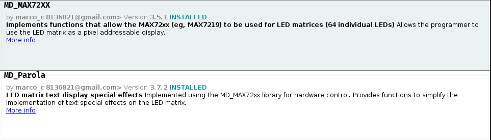

# Matriz Led
En esta carpeta se encuentra el archivo de proteus con la simulacion para el uso de matrices led, el codigo de arduino Y la captura de la libreria que deben utilizar.  
Mucho OJO con el fabricante o propietario de la libreria que tienen que instalar, para que no tengan problemas.  

El video de la explicacion se encuentra en el siguiente drive:  
[Video Explicacion Matriz Led](https://drive.google.com/file/d/1sG_d5RUG3EzcXrxI2I-E3M68yR8bnvct/view?usp=sharing)  
  
Ademas les dejo un video de youtube que contiene una explicacion mas detallada del componente de manera fisica.

[Video Youtube](https://youtu.be/_QNUIiuW2N0?si=FekBMrm4scw1T-z-)

## LIBRERIA  
  

## DOCUMENTACION OFICIAL
[Documentacion Parola](https://majicdesigns.github.io/MD_Parola/class_m_d___parola.html)